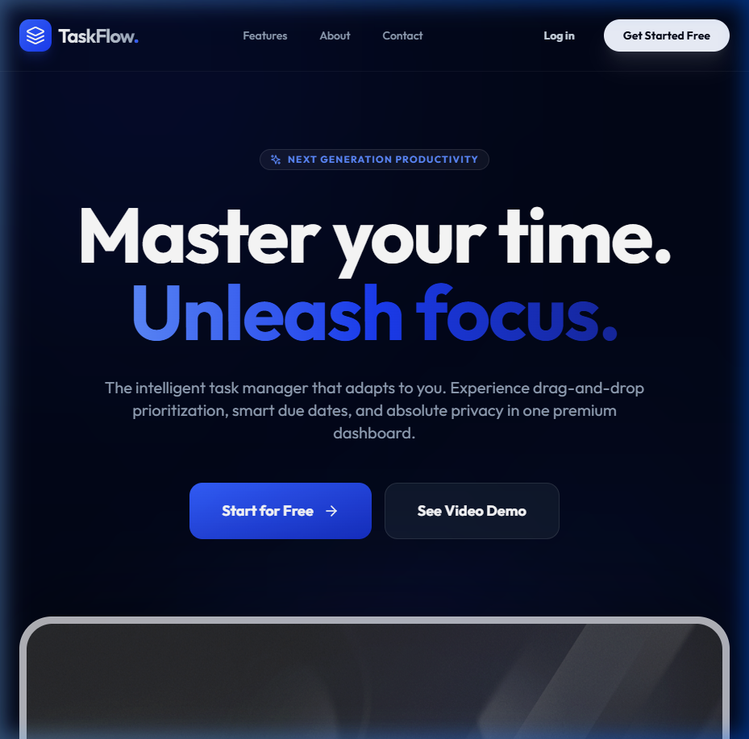
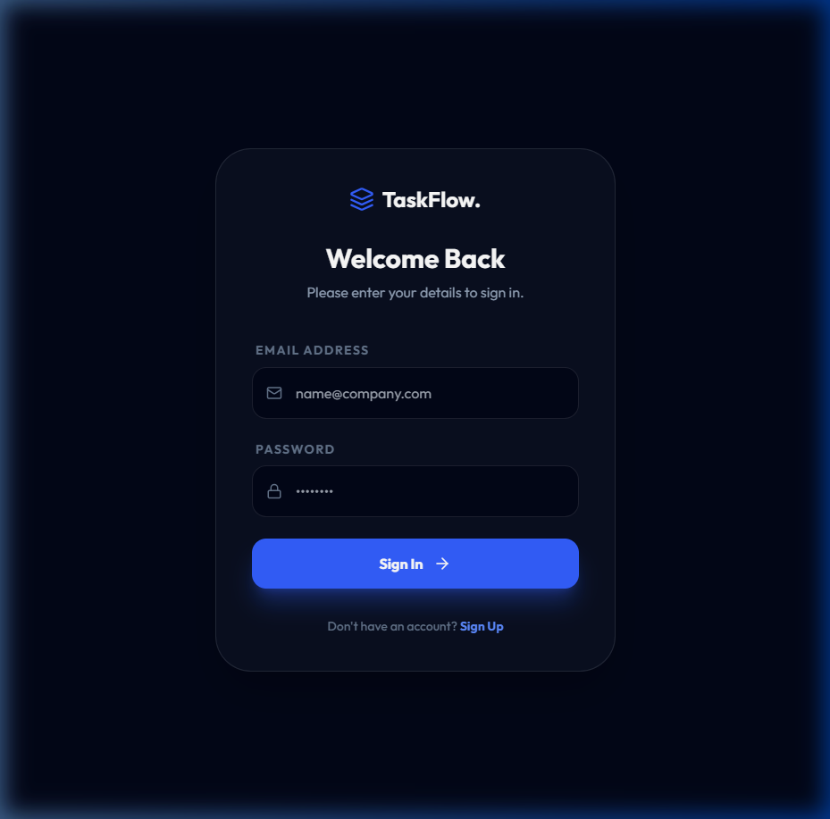
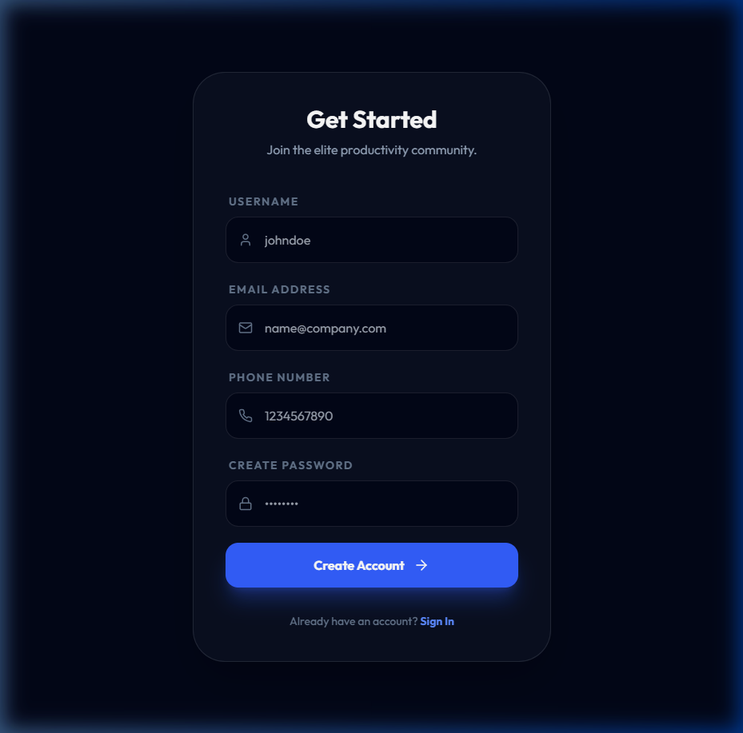
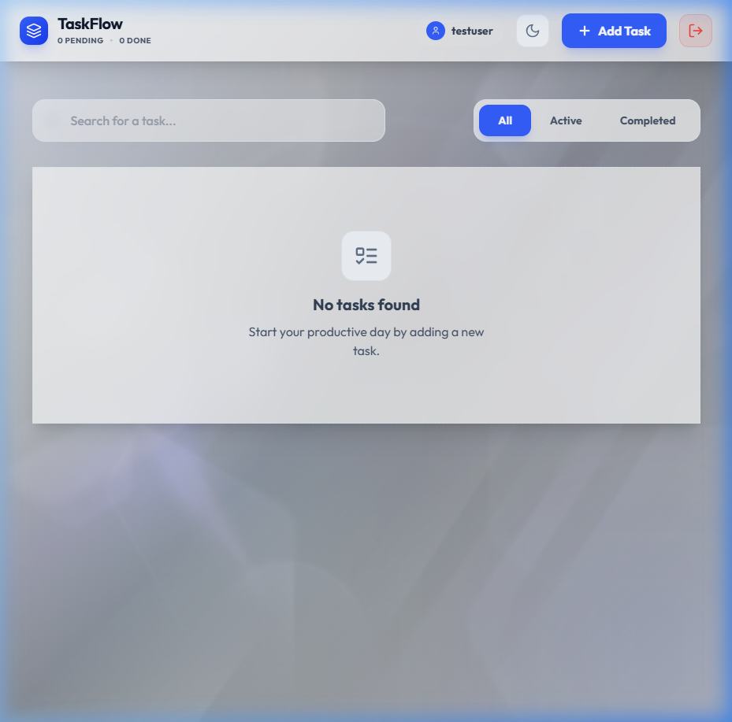
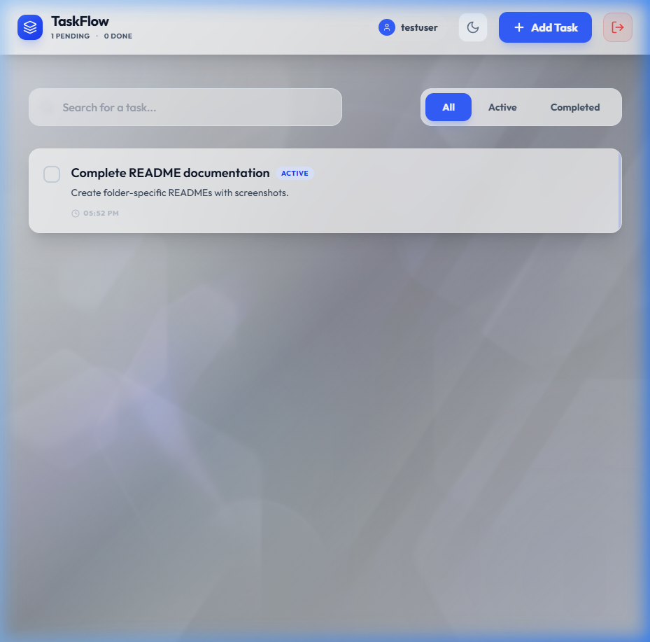

# TaskFlow - Backend API

This is the backend service for the TaskFlow application, built with **Node.js**, **Express**, and **MongoDB**. It provides a secure RESTful API for managing tasks and user authentication.

## 🌐 Live URLs
- **Backend API**: **[https://todo-app-yv0u.onrender.com](https://todo-app-yv0u.onrender.com)**
- **Frontend Application**: **[https://aswini-todo-app.vercel.app](https://aswini-todo-app.vercel.app)**

## 🚀 Setup and Run Instructions

1.  **Navigate to the backend folder**:
    ```bash
    cd backend
    ```
2.  **Install dependencies**:
    ```bash
    npm install
    ```
3.  **Configure Environment Variables**:
    Create a `.env` file in the root of the `backend` folder based on `.env.example`:
    ```env
    PORT=5000
    MONGODB_URI=your_mongodb_connection_string
    JWT_SECRET=your_jwt_secret_key
    FRONTEND_URL=http://localhost:3000
    ```
4.  **Start the development server**:
    ```bash
    npm run dev
    ```
    The API will be available at `http://localhost:5000`.

---

## 📸 Application Screenshots

### Landing Page


### Authentication (Login & Signup)



### Dashboard (Task Management)



---

## 🛠️ Technologies Used

-   **Runtime**: Node.js
-   **Framework**: Express.js
-   **Database**: MongoDB (via Mongoose ODM)
-   **Authentication**: JSON Web Tokens (JWT) & bcryptjs
-   **Middleware**: CORS, Dotenv, JWT-based protected routes

---

## 🔐 Environment Variables (.env.example)

-   `PORT`: The port on which the server will run.
-   `MONGODB_URI`: The connection string for your MongoDB instance.
-   `JWT_SECRET`: A secure key used for signing and verifying tokens.
-   `FRONTEND_URL`: Used for CORS configuration to allow requests from your frontend.

---

## 📑 API Endpoints

| Method | Endpoint | Description | Auth Required |
|---|---|---|---|
| `POST` | `/api/auth/register` | Register a new user | No |
| `POST` | `/api/auth/login` | Login and get JWT | No |
| `GET` | `/api/todos` | Fetch all tasks | Yes |
| `POST` | `/api/todos` | Create a new task | Yes |
| `PUT` | `/api/todos/:id` | Update a task | Yes |
| `DELETE` | `/api/todos/:id` | Delete a task | Yes |

---

## 🧠 Challenges and Solutions

### 1. Secure Authentication
**Challenge**: Ensuring that user credentials are stored safely and only authorized users can modify their own tasks.
**Solution**: Implemented `bcryptjs` for one-way password hashing and `jsonwebtoken` (JWT) for stateless authentication. Created a custom `authMiddleware` to protect sensitive routes.

### 2. Cross-Origin Resource Sharing (CORS)
**Challenge**: The frontend and backend run on different ports, leading to browser blocks during API calls.
**Solution**: Configured the `cors` package to dynamically allow requests from the `FRONTEND_URL` environment variable, ensuring security in both local and production environments.

### 3. Production Readiness
**Challenge**: Preparing the app for cloud deployment (e.g., Render).
**Solution**: Refactored the entry point to prioritize `process.env.PORT` and ensured all database sensitive data is handled via environment variables only.

---

## 🤖 AI Tool Usage Disclosure

As part of the development process for this application, the following AI tools were utilized:
- **Tool Used**: Antigravity (AI Coding Assistant)
- **Purpose**: Assisted with setting up robust backend architecture, debugging MongoDB connection issues, and configuring CORS and deployment environments for Render.

### AI Certifications
I am currently enrolled in an AI certification program at **Genaversity**. The certification is actively in progress and will be officially awarded upon the completion of the course curriculum.
